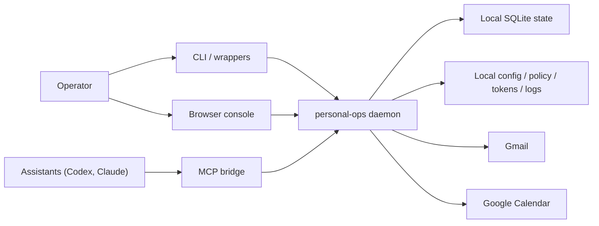

# ARCHITECTURE

This document describes the current `personal-ops` system shape after Phases 1 to 8.

## Purpose

`personal-ops` is a local control plane for personal workflow.

It exists so assistants can help with inbox, calendar, task, planning, and draft workflow without taking direct ownership of provider-side logic or high-trust actions.

The trust model is intentional:

- assistants are clients of `personal-ops`
- the operator stays in charge of risky or externally mutating flows
- one primary machine owns the active local state

## Runtime components

Main runtime pieces:

- local daemon
- local SQLite database
- local config and policy files
- operator CLI
- local operator console
- local HTTP API
- MCP bridge for assistants
- generated wrappers
- LaunchAgent-managed background runtime

## Control-plane flow

## Local state and path model

Default path layout:

- repo app path: `~/.local/share/personal-ops/app`
- config: `~/.config/personal-ops`
- state: `~/Library/Application Support/personal-ops`
- logs: `~/Library/Logs/personal-ops`

Important runtime artifacts:

- `config.toml`
- `policy.toml`
- OAuth client JSON
- local API token files
- SQLite database
- machine identity metadata
- restore provenance metadata
- generated install manifest
- recovery snapshots

Machine model:

- the local machine owns the active state by default
- backups are the supported recovery and intentional migration mechanism
- restore replaces local state; it does not merge state
- no live sync or multi-writer model is supported

## Interface surfaces

### CLI

The CLI is the operator-facing surface for:

- status
- worklist
- doctor
- install and backup
- inbox, calendar, tasks, planning, approvals, and reviews

Recent operator-focused entrypoints:

- `personal-ops now`
- `personal-ops status`
- `personal-ops worklist`
- `personal-ops doctor`
- `personal-ops install check`

### Local HTTP API

The local HTTP API is the stable machine-readable surface used by the CLI, the local browser console, and other local clients.

It remains:

- local-only
- token-gated
- intentionally narrow for audit and governance

Phase 8 adds a same-origin browser session for the console, but it stays read-only and daemon-local.

### Operator console

The operator console is a same-origin local web UI served by the daemon.

It is intentionally read-first in Phase 8:

- status and worklist visibility
- approvals and drafts inspection
- planning and audit inspection
- backup list and provenance inspection

It does not replace the CLI for high-trust or mutating actions.

### MCP bridge

The MCP bridge is the assistant-facing access path.

It is for shared safe reads and limited safe creation flows, not provider ownership or operator-only control.

Wrappers currently exist for:

- Codex
- Claude

## Trust boundaries

### Assistant-safe surfaces

Assistants may read shared operational state such as:

- status and worklist
- inbox and calendar context
- tasks and planning reads
- assistant-safe audit reads

Assistants may create only the limited suggestion surfaces already allowed by contract.

### Operator-only surfaces

These remain outside assistant control:

- live send control
- review opening and resolve flows
- inbox and calendar sync mutation
- calendar writes
- planning recommendation apply, reject, snooze, refresh, and replan
- policy and governance mutation

`CLIENTS.md` remains the authoritative contract for the safe read surface and operator-only boundaries.

## Current code shape

After Phase 2 and Phase 4, the repo uses compatibility facades plus domain modules:

- `app/src/cli.ts`
  thin CLI wiring plus command registration
- `app/src/formatters.ts`
  formatter facade that exports domain formatter modules
- `app/src/service.ts`
  main service facade with extracted status, audit, and install helpers
- `app/src/db.ts`
  stable database facade

Supporting domain folders now include:

- `app/src/cli/`
- `app/src/formatters/`
- `app/src/service/`

This is not the final modular shape, but it is the stable Phase 2 baseline the later phases now build on.

## Where future work should land

Use these rules for future changes:

- docs and onboarding guidance
  update `START-HERE.md`, `QUICK-GUIDE.md`, `OPERATIONS.md`, and `ARCHITECTURE.md`
- operational install, auth, bootstrap, restore, and troubleshooting changes
  update `OPERATIONS.md` first, then supporting setup docs if needed
- machine ownership and backup portability rules
  update `OPERATIONS.md`, `ARCHITECTURE.md`, and the active phase docs together
- trust model or client contract changes
  update `CLIENTS.md` and the relevant rollout docs
- architecture or subsystem shape changes
  update `ARCHITECTURE.md` and the active phase docs
- future operator console work
  keep the existing local HTTP API as the primary backend surface and keep browser-session additions narrow and read-first unless a later track explicitly expands mutation support

## Related docs

- [START-HERE.md](START-HERE.md)
- [QUICK-GUIDE.md](QUICK-GUIDE.md)
- [OPERATIONS.md](OPERATIONS.md)
- [CLIENTS.md](CLIENTS.md)
- [docs/IMPROVEMENT-ROADMAP.md](docs/IMPROVEMENT-ROADMAP.md)
