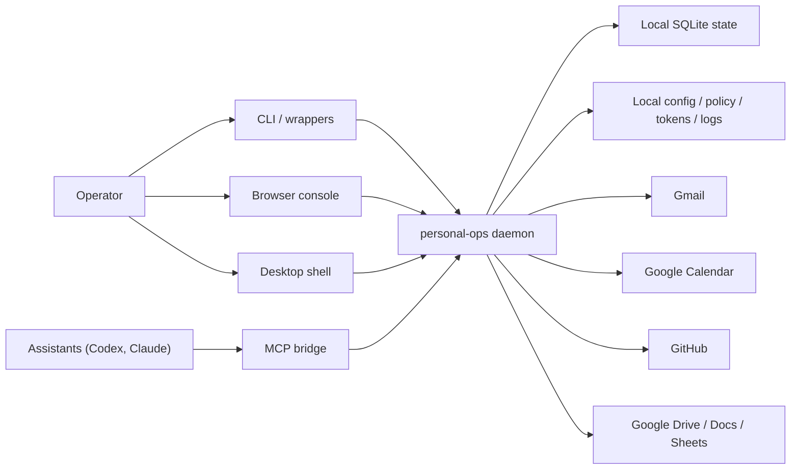

# ARCHITECTURE

This document describes the current `personal-ops` system shape after the completed assistant-led track through Phase 38.

## Purpose

`personal-ops` is a local control plane for personal workflow.

It exists so assistants can help with inbox, calendar, task, planning, draft, narrow GitHub PR and review workflow, and narrow Google Docs plus Sheets context without taking direct ownership of provider-side logic or high-trust actions.

The trust model is intentional:

- assistants are clients of `personal-ops`
- the operator stays in charge of risky or externally mutating flows
- one primary machine owns the active local state

## Runtime components

Main runtime pieces:

- local daemon
- local SQLite database
- local config and policy files
- operator CLI
- local operator console
- optional macOS desktop shell
- local HTTP API
- MCP bridge for assistants
- generated wrappers
- LaunchAgent-managed background runtime

## Control-plane flow

## Local state and path model

Default path layout:

- repo app path: `~/.local/share/personal-ops/app`
- config: `~/.config/personal-ops`
- state: `~/Library/Application Support/personal-ops`
- logs: `~/Library/Logs/personal-ops`

Important runtime artifacts:

- `config.toml`
- `policy.toml`
- OAuth client JSON
- local API token files
- SQLite database
- machine identity metadata
- restore provenance metadata
- generated install manifest
- recovery snapshots

Machine model:

- the local machine owns the active state by default
- backups are the supported recovery and intentional migration mechanism
- restore replaces local state; it does not merge state
- no live sync or multi-writer model is supported

## Interface surfaces

### CLI

The CLI is the operator-facing surface for:

- status
- worklist
- doctor
- install and backup
- inbox, calendar, tasks, planning, approvals, and reviews

Recent operator-focused entrypoints:

- `personal-ops now`
- `personal-ops status`
- `personal-ops worklist`
- `personal-ops doctor`
- `personal-ops install check`
- `personal-ops github status`
- `personal-ops github reviews`
- `personal-ops github pulls`
- `personal-ops github pr <owner/repo#number>`
- `personal-ops drive status`
- `personal-ops drive files`
- `personal-ops drive doc <fileId>`
- `personal-ops drive sheet <fileId>`
- `personal-ops install desktop`
- `personal-ops desktop open`
- `personal-ops desktop status`
- `personal-ops autopilot status`
- `personal-ops autopilot run`

### Local HTTP API

The local HTTP API is the stable machine-readable surface used by the CLI, the local browser console, and other local clients.

It remains:

- local-only
- token-gated
- intentionally narrow for audit and governance

The earlier Phase 8 console foundation added a same-origin browser session for the console, and the later assistant-led phases widened it only for narrow operator-safe actions. It remains daemon-local and intentionally allowlisted.

### Operator console

The operator console is a same-origin local web UI served by the daemon.

It now supports narrow operator-safe execution, including:

- assistant queue execution for low-risk local actions
- inbox autopilot draft preparation and review handoff
- meeting packet preparation and refresh
- planning autopilot bundle preparation and explicit grouped apply
- grouped outbound request-approval, approve, and send for reviewed mail work
- status, worklist, approvals, drafts, planning, audit, backup, GitHub, and Drive visibility

It still does not replace the CLI for high-trust control surfaces like send-window enablement, restore, auth mutation, or destructive flows.

### Continuous autopilot

The assistant-led track added one coordinator for safe background preparation.

That coordinator now owns warm-start preparation for:

- day-start workflow summaries
- inbox autopilot preparation
- meeting-packet preparation
- planning autopilot bundle preparation
- outbound finish-work recomputation

It also publishes freshness state that the console and desktop shell can render without widening mutation scope.

### Desktop shell

Assistant-Led Phase 4 adds an optional macOS Tauri shell under `desktop/`.

It is intentionally a thin operator client:

- it loads the existing console UI in a native webview
- it requests console launch grants from the daemon through `POST /v1/console/session`
- it adds tray or menu bar affordances plus bounded desktop notifications
- it does not become a second control plane or a second source of truth

The daemon and CLI remain authoritative. The desktop shell is a convenience client for the same local system.

### MCP bridge

The MCP bridge is the assistant-facing access path.

It is for shared safe reads and limited safe creation flows, not provider ownership or operator-only control.

Wrappers currently exist for:

- Codex
- Claude

## Trust boundaries

### Assistant-safe surfaces

Assistants may read shared operational state such as:

- status and worklist
- inbox and calendar context
- tasks and planning reads
- assistant-safe GitHub PR and review reads
- assistant-safe Drive status, file metadata, cached Docs reads, and cached Sheets preview reads
- assistant-safe audit reads

Assistants may create only the limited suggestion surfaces already allowed by contract.

### Operator-only surfaces

These remain outside assistant control:

- live send control
- review opening and resolve flows
- inbox and calendar sync mutation
- calendar writes
- raw planning recommendation apply, reject, snooze, refresh, and replan outside the narrow planning bundle path
- planning bundle grouped apply is operator-only, confirmation-gated, note-required, and audit-logged
- grouped outbound request-approval, approve, and send remain operator-only, note-required, and confirmation-gated where applicable
- send-window control remains CLI-only even though grouped outbound send now runs from the console once the window is already active
- policy and governance mutation
- GitHub auth mutation and explicit GitHub sync mutation
- any GitHub write action
- any Google write action through Drive, Docs, or Sheets
- any new high-trust mutation through the desktop shell

`CLIENTS.md` remains the authoritative contract for the safe read surface and operator-only boundaries.

## Current code shape

After Phase 2 and Phase 4, the repo uses compatibility facades plus domain modules:

- `app/src/cli.ts`
  thin CLI wiring plus command registration
- `app/src/formatters.ts`
  formatter facade that exports domain formatter modules
- `app/src/service.ts`
  main service facade with extracted status, audit, and install helpers
- `app/src/db.ts`
  stable database facade

Supporting domain folders now include:

- `app/src/cli/`
- `app/src/formatters/`
- `app/src/service/`

The assistant-led track also adds:

- `app/src/service/autopilot.ts`
  the continuous warm-start coordinator and freshness model

This is not the final modular shape, but it is the stable Phase 2 baseline the later phases now build on.

## Where future work should land

Use these rules for future changes:

- docs and onboarding guidance
  update `START-HERE.md`, `QUICK-GUIDE.md`, `OPERATIONS.md`, and `ARCHITECTURE.md`
- operational install, auth, bootstrap, restore, and troubleshooting changes
  update `OPERATIONS.md` first, then supporting setup docs if needed
- machine ownership and backup portability rules
  update `OPERATIONS.md`, `ARCHITECTURE.md`, and the active phase docs together
- trust model or client contract changes
  update `CLIENTS.md` and the relevant rollout docs
- architecture or subsystem shape changes
  update `ARCHITECTURE.md` and the active phase docs
- future operator console work
  keep the existing local HTTP API as the primary backend surface and keep browser-session or desktop-session additions narrow unless a later track explicitly expands mutation support

## Related docs

- [START-HERE.md](START-HERE.md)
- [QUICK-GUIDE.md](QUICK-GUIDE.md)
- [OPERATIONS.md](OPERATIONS.md)
- [CLIENTS.md](CLIENTS.md)
- [docs/archive/README.md](docs/archive/README.md)
